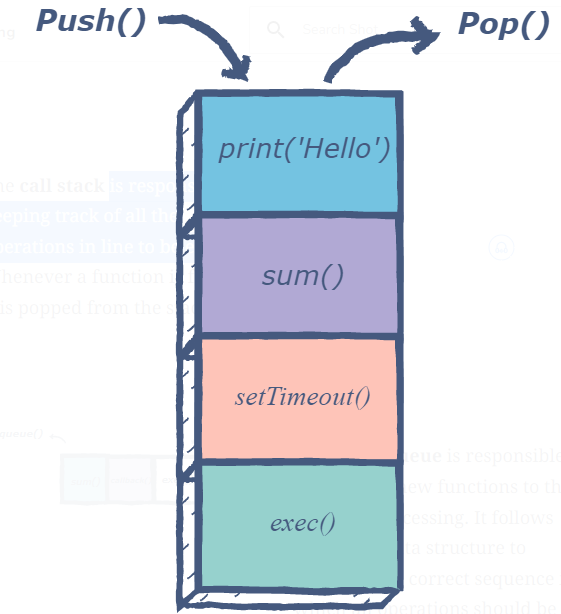
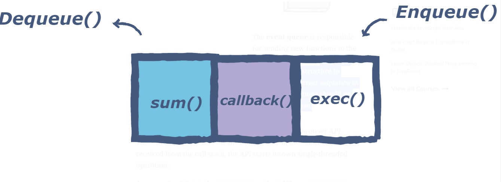
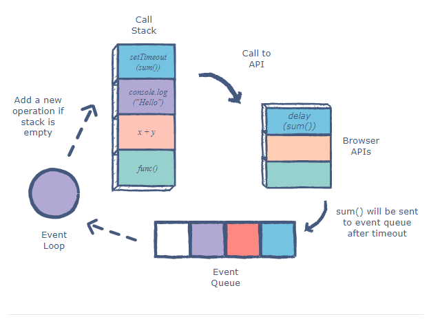
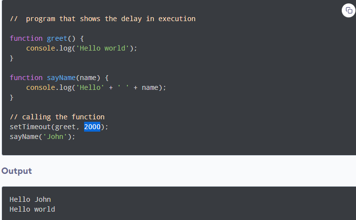
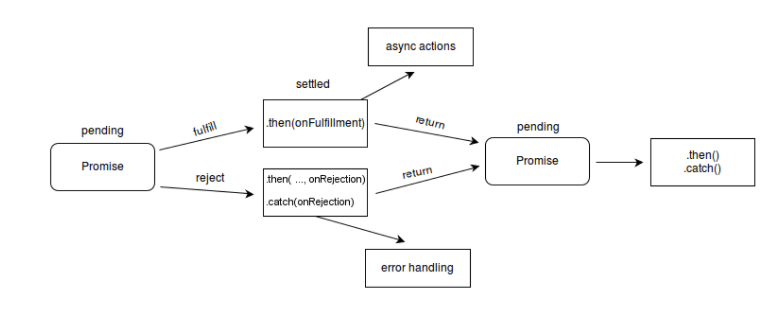
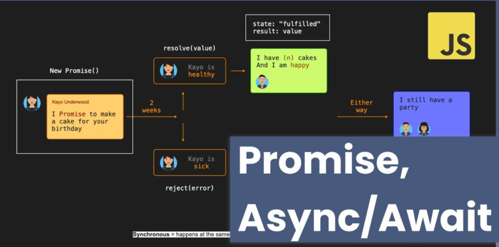
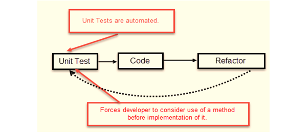

# The conclusion I understood 🧐

>##  Displayed The keywords 📋
>
>* Event Loop 🔁.
>* JS callback functions 📞🔙.
>* JS Promises 🤝.
>* JS Async/Await ⌛.
>* Test-Driven Development 🧪.
>
----

1) ## Event loop 🔁

> **Is the secret behind JavaScript’s *asynchronous programming***.
>>
----
>>
>> * Code execution stages.

>> 1) ### **call stack** :Is responsible for keeping track of all the operations in line to be executed

>>

>> 2) ### **Event queue** : Is responsible for sending new functions to the stack for processing. Keeping the correct sequence to execute code
>>
>>

>> 3) ### **Browser API** : Whenever an async function is called, it is sent to a browser API. Example setTimeout method. When a setTimeout operation is processed in the stack, it is sent to the corresponding API which waits till the specified time to send this operation back in for processing
>>
>>

 ***The event loop facilitates this process.***
>

----

2) ## JS callback functions 📞🔙

 > using a callback function is that you can wait for the result of a previous function call and then execute another function call.
 >>Use the **setTimeout()** method to mimic the program that takes time to execute, such as data coming from the server.
 >
 ----

3) ## JS Promises 🤝

 > Object represents the eventual completion (or failure) of an asynchronous operation and its resulting value.
 >> ***A Promise is in one of these states.***
 >>
 >> * pending: initial state, neither fulfilled nor rejected.
>>* fulfilled: meaning that the operation was completed successfully.
>>* rejected: meaning that the operation failed.

 >
 ----

4) ## JS Async/Await ⌛

 > * Async functions are a combination of promises and generators, and basically, they are a higher level abstraction over promises. async/await is built on promises.
 > * Await: Await function is used to wait for the promise. It could be used within the async block only. It makes the code wait until the promise returns a result. It only makes the async block wait.
  >
  >
  -----

4) ## Test-Driven Development 🧪
 > Is software development approach in which test cases are developed to specify and validate what the code will do.
 >
 [Read more about Test-Driven Development](https://www.guru99.com/test-driven-development.html)

