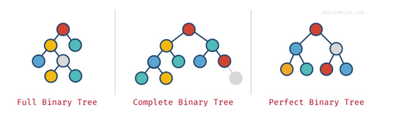

[Live URL](https://mujahedyousef.github.io/advanced-js-reading-notes.-/day_13/class_13.html)

# Tree Data Structures in JavaScript

> Is a data structure where a node can have zero or more children. Each node contains a value. Like graphs, the connection between nodes is called edges. A tree is a type of graph, but not all graphs are trees.


|properties of trees | explained |
|----|---|
|Node |A Tree node is a component which may contain its own values, and references to other nodes|
|Root | The root is the node at the beginning of the tree|
|K  |A number that specifies the maximum number of children any node may have in a k-ary tree. In a binary tree, k = 2.|
|Left  |A reference to one child node, in a binary tree|
|Right | A reference to the other child node, in a binary tree|
|Edge | The edge in a tree is the link between a parent and child node|
|Leaf | A leaf is a node that does not have any children|
|Height | The height of a tree is the number of edges from the root to the furthest leaf|
-----

> Binary Trees

* Trees nodes can have zero or more children. However, when a tree has at the most two children, then it’s called binary tree.

> Full, Complete, and Perfect binary trees
Depending on how nodes are arranged in a binary tree, it can be full, complete and perfect:

* Full binary tree: each node has exactly 0 or 2 children (but never 1).
* Complete binary tree: when all levels except the last one are full with nodes.
* Perfect binary tree: when all the levels (including the last one) are full of nodes.

-------------

## Traversals

 > a tree allows us to.

 1. search for a node.
 2. print out the contents of a tree, and much more!

   >There are two categories of traversals when it comes to trees:

1. Depth First.
2. Breadth-First.

-----
> Depth First

```
traversal is where we prioritize going through the depth (height) of the tree first.
```

> three methods for depth first traversal:

```
1. Pre-order: root >> left >> right
2. In-order: left >> root >> right
3. Post-order: left >> right >> root
```

----

> Breadth-first

```
traversal iterates through the tree by going through each level of the tree node-by-node.
```


