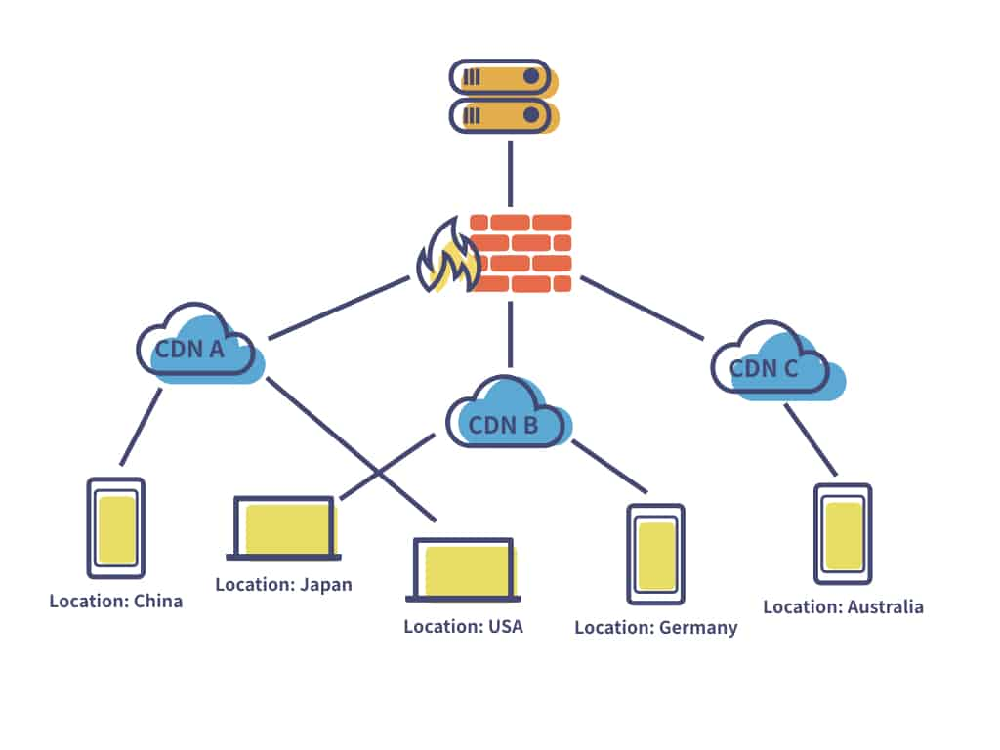

[Link URL](https://mujahedyousef.github.io/advanced-js-reading-notes.-/day_15/class_15.html)

# Readings: AWS: S3 and Lambda

## AWS S3

> Amazon Simple Storage Service (Amazon S3) is a scalable, high-speed, web-based cloud storage service. The service is designed for online backup and archiving of data and applications on Amazon Web Services (AWS).

> Amazon S3 features:

1. Provides  durability for objects stored in the service and supports multiple security and compliance certifications

1. An administrator can also link S3 to other AWS security and monitoring services, including CloudTrail, CloudWatch and Macie.

1. An extensive partner network of vendors that link their services directly to S3.

1. Data can be transferred to S3 over the public internet via access to S3 application programming interfaces (APIs).

1. Amazon S3 Transfer Acceleration for faster movement over long distances.

1. AWS Direct Connect for a private, consistent connection between S3 and an enterprise's own data center.
1. users can integrate other AWS services with S3.

> Use cases for S3 :

1. Data storage;
1. data archiving;
1. application hosting for deployment, installation and management of web apps;
1. software delivery;
1. data backup;
1. disaster recovery (DR);
1. running big data analytics tools on stored data;
1. data lakes;
1. mobile applications;
1. internet of things (IoT) devices;
1. media hosting for images, videos and music files;
1. website hosting -- particularly well suited to work with Amazon CloudFront for content delivery.

----

## AWS Lambda Basics

> AWS Lambda is a way to run code without creating, managing, or paying for servers. You supply AWS with the code required to run your function.

* AWS will scale your code for you, depending on the number of requests it receives. Not having to build and pay for servers is nice.

----

## AWS Lambda Functions

* AWS Lambda is a serverless, event-driven compute service that lets you run code for virtually any type of application or backend service without provisioning or managing servers. You can trigger Lambda from over 200 AWS services and software as a service (SaaS) applications and only pay for what you use.

----

## CDN

> A Content Delivery Network (CDN) is a geographically distributed group of servers that work together to provide fast delivery of Internet content. A CDN allows for the fast transfer of data needed for loading Internet content including HTML pages, javascript files, stylesheets, images, and videos.

