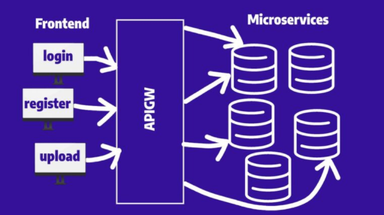
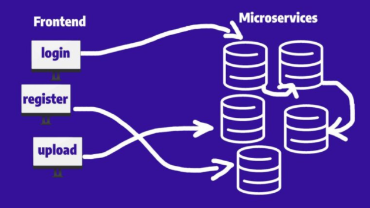
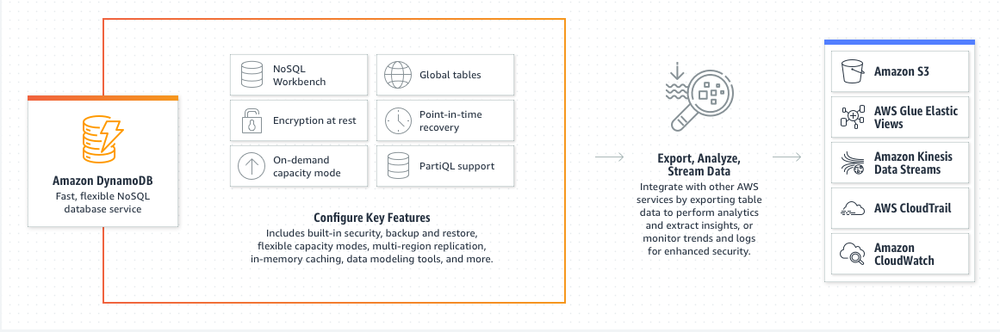

[Linl URL](https://mujahedyousef.github.io/advanced-js-reading-notes.-/day_16/class_16.html)

# Readings: AWS: API, Dynamo and Lambda

------

## AWS API Gateway

 > Is an interface that sits in between the application and the micro services. Developers use them to create, publish, maintain, monitor, and secure APIs.

 <kbd> Without using an API Gateway</kbd> you’d have to connect all your API resources directly with your user-facing applications which would make it more difficult to manage responses, implement updates to your business logic or even secure your API.

> <kbd>API Gateway it will boost your security since you are not exposing any endpoints, minimizing the attack vector considerably</kbd>

> What does an API Gateway do?

* An API Gateway can handle any type of interaction between your website, web or mobile application, or even IoT devices and your microservices.

> What is AWS API Gateway? /Benefits:-

* It’s a fully managed service that provides all the necessary tools for developers in order to

 <kbd>
1.create
</kbd>
<kbd>
2. publish,
</kbd>
<kbd>
3. manage and ,
</kbd>
<kbd>
4. secure your API regarding scale.
</kbd>

* Amazon API Gateway will take care of all the tasks involved in accepting and processing up to hundreds of thousands of concurrent API calls, including

1. traffic management
2. authorization
3. access control
4. monitoring
5. and API version management.

> AWS API Gateway architecture.

1. Written in Node.js, it can be configured as the backbone of the AWS Cloud as it is the gateway between all the connected services in the AWS ecosystem.

2. Amazon API Gateway is a closed-source software-as-a-service (SaaS) product written in Node.js available only on AWS. Amazon API Gateway can be considered a backplane in the AWS ecosystem.

3. In conjuncture with AWS Lambda, the API gateway forms the client-facing part of Amazon’s serverless infrastructure. Lambda runs the code on the highly available, fully managed computing infrastructure but relies on API gateway to expose those endpoints to the required services.

4. To enable the serverless applications, API Gateway supports streamlined proxy integrations with AWS Lambda and HTTP endpoints.

<kbd>Features include:

* Build, deploy and manage APIs
* Resiliency
* API lifecycle management
* SDK generation
* API operations monitoring
* AWS authorization
* API keys for third-party developers

|name |Link|
|----|----|
|Amazon API Gateway|[Read more](https://www.serverless.com/guides/amazon-api-gateway)|
|Amazon API Gateway|[AWS link](https://aws.amazon.com/api-gateway/) |
------

## DynamoDB

> Is a hosted NoSQL database offered by Amazon Web Services (AWS).

> Features:

* reliable performance even as it scales.
* a managed experience, so you won't be SSH-ing into servers to upgrade the crypto libraries.
* a small, simple API allowing for simple key-value access as well as more advanced query patterns.

> It use cases:

* Applications with large amounts of data and strict latency requirements.
* Serverless applications using AWS Lambda
* Data sets with simple, known access patterns.

----

## Dynamoose

> is a modeling tool for Amazon's DynamoDB.

> Key Features

* Type safety
* High level API
* Easy to use syntax
* Ability to transform data before saving or retrieving documents
* Strict data modeling (validation, required attributes, and more)
* Support for DynamoDB Transactions
* Powerful Conditional/Filtering Support
* Callback & Promise support

----
|name |Link|
|----|----|
|DynamoDB|[Read more](https://www.dynamodbguide.com/what-is-dynamo-db)|
|Amazon DynamoDB|[Read more](https://aws.amazon.com/dynamodb/) |
|Dynamoose| [Read more](https://dynamoosejs.com/getting_started/Introduction)|
