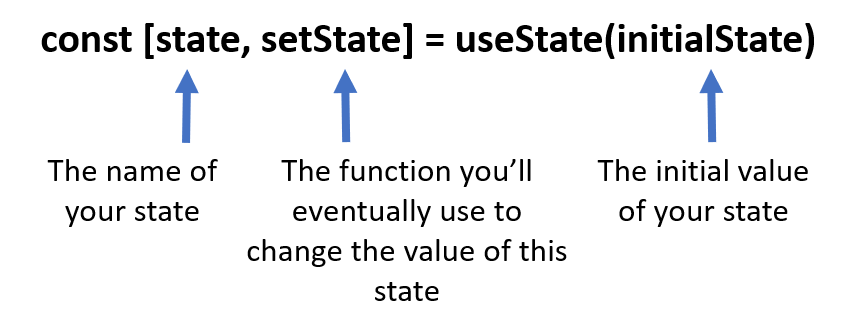

[useState() Hook live URL](https://mujahedyousef.github.io/advanced-js-reading-notes.-/day_18/class_18.html)

## Hook

> Hooks are the new feature introduced in the React 16.8 version. It allows you to use state and other React features without writing a class.

> Hooks are the functions which "hook into" React state and lifecycle features from function components. It does not work inside classes.

### When to use a Hooks?

- If you write a function component, and then you want to add some state to it, previously you do this by converting it to a class. But, now you can do it by using a Hook inside the existing function component.

### Rules of Hooks

1. Only call Hooks at the top level.
1. Only call Hooks from React functions.

### useState( ) Hook

> Hook state is the new way of declaring a state in React app. Hook uses useState() functional component for setting and retrieving state.

### Hooks API Reference

* Basic Hooks

   - useState
   - useEffect
   - useContext

* Additional Hooks

    - useReducer
    - useCallback
    - useMemo
    - useRef
    - useImperativeHandle
    - useLayoutEffect
    - useDebugValue
    - useDeferredValue
    - useTransition
    - useId

* Library Hooks

    - useSyncExternalStore
    - useInsertionEffect
