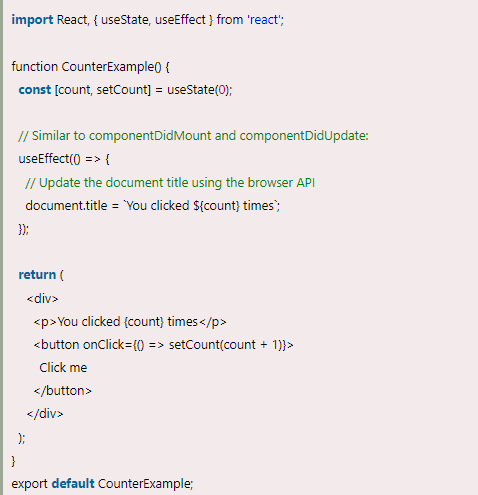

[useEffect() Hook live Url](https://mujahedyousef.github.io/advanced-js-reading-notes.-/day_19/class_19.html)

## Effect Hook

> The Effect Hook allows us to perform side effects (an action) in the function components. It does not use components lifecycle methods which are available in class components. In other words, Effects Hooks are equivalent to componentDidMount(), componentDidUpdate(), and componentWillUnmount() lifecycle methods.

> Side effects have common features which the most web applications need to perform, such as:

- Updating the DOM,
- Fetching and consuming data from a server API,
- Setting up a subscription, etc.

> In React component, there are two types of side effects:

1. Effects Without Cleanup

        It is used in useEffect which does not block the browser from updating the screen. It makes the app more responsive. The most common example of effects which don't require a cleanup are manual DOM mutations, Network requests, Logging, etc.

1. Effects With Cleanup

               Some effects require cleanup after DOM updation. For example, if we want to set up a subscription to some external data source, it is important to clean up memory so that we don't introduce a memory leak. React performs the cleanup of memory when the component unmounts. However, as we know that, effects run for every render method and not just once. Therefore, React also cleans up effects from the previous render before running the effects next time.