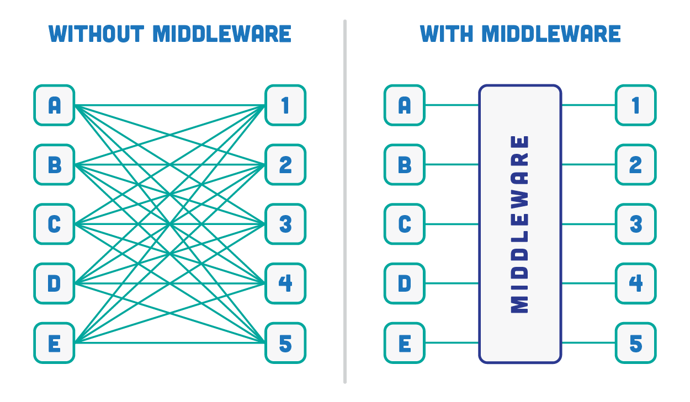
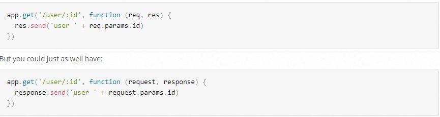
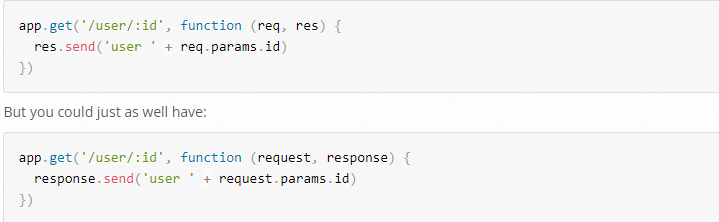

# Reading Express, API Rest

----

## Express js

> Is a routing and middleware web framework that has minimal functionality of its own: An Express application is essentially a series of middleware function calls.

 > * Middleware : functions are functions that have access to the request object (req), the response object (res), and the next middleware function in the application’s request-response cycle. The next middleware function is commonly denoted by a variable named next.
 >
* >Types of express middleware

* Application level middleware (app.use)

* Router level middleware (router.use)
* Built-in middleware (express.static,express.json,express.urlencoded)
* Error handling middleware (app.use(err,req,res,next))
* Thirdparty middleware (bodyparser,cookieparser)

 > 
 >>
 >> * Request object : The req object represents the HTTP request and has properties for the request query string, parameters, body, HTTP headers, and so on. In this documentation and by convention, the object is always referred to as req (and the HTTP response is res) but its actual name is determined by the parameters to the callback function in which you’re working.
 > 

 >> * Response object : The res object represents the HTTP response that an Express app sends when it gets an HTTP request.
In this documentation and by convention, the object is always referred to as res (and the HTTP request is req) but its actual name is determined by the parameters to the callback function in which you’re working.
> > 

> * Routing : Refers to how an application’s endpoints (URIs) respond to client requests. For an introduction to routing.
 >>
 > * > Basic Routes: Home, About
 > * > Route Middleware to log requests to the console
 > * > Route with Parameters
 > * > Route Middleware for Parameters to validate specific parameters
> * > Login routes Doing a GET and POST on /login
Validates a parameter passed to a certain route.
