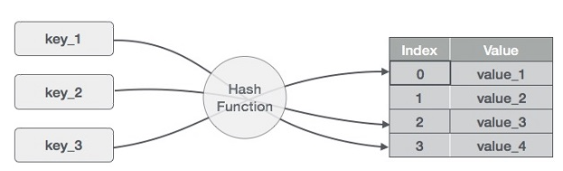

[Hash Tables live url](https://mujahedyousef.github.io/advanced-js-reading-notes.-/day_21/class_21.html)

# Hash Tables

- Hash Table is a data structure that stores data in an associative manner. In a hash table,

  - data is stored in an array format,
  - where each data value has its own unique index value.
  - Access of data becomes very fast if we know the index of the desired data.

- Thus, it becomes a data structure

  - in which insertion

  - search operations are very fast irrespective of the size of the data.
  - Hash Table uses an array as a storage medium and uses a hash technique to generate an index where an element is to be inserted or is to be located.

## Hashing
* Hashing is a technique to convert a range of key values into a range of indexes of an array. We're going to use the modulo operator to get a range of key values.

## Linear Probing

* As we can see, it may happen that the hashing technique is used to create an already used index of the array. In such a case, we can search for the next empty location in the array by looking into the next cell until we find an empty cell. This technique is called linear probing.

### basic primary operations of a hash table.

* Search − Searches an element in a hash table.

* Insert − inserts an element in a hash table.

* delete − Deletes an element from a hash table.