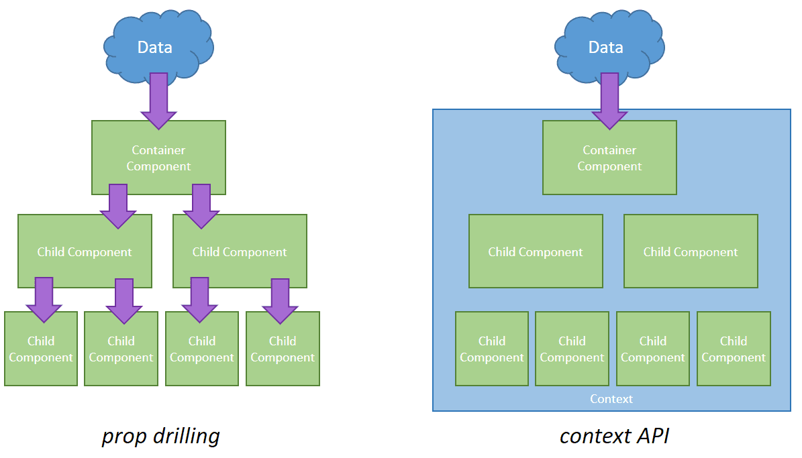
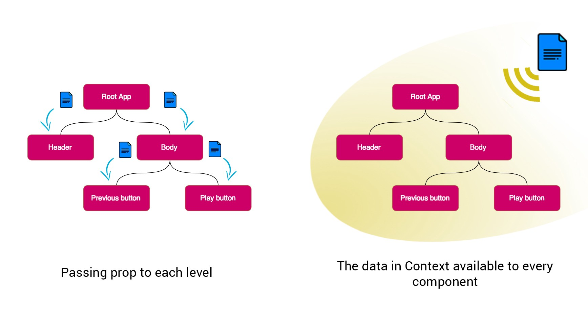

# Context API

## What is Context API?

- The React Context API is a way for a React app to effectively produce global variables that can be passed around.
- This is the alternative to "prop drilling" or moving props from grandparent to child to parent, and so on.
- Context is also touted as an easier, lighter approach to state management using Redux.

- Context API is a (kind of) new feature added in version 16.3 of React that allows one to share state across the entire app (or part of it) lightly and with ease.



## How does it work?

- React.createContext() is all you need.
- It returns a consumer and a provider.
- The provider is a component that as its name suggests provides the state to its children.
- It will hold the "store" and be the parent of all the components that might need that store.
- Consumer as it so happens is a component that consumes and uses the state.

## Context API will replace redux?



No. Well, not entirely.

Redux is great and came perfectly to answer the need for state management. Actually, it answered this need so well that it came to be known that you can't be a "true" React developer if you don't know your way around Redux. However, Redux has its disadvantages, and that's why it's important to know what Context API gives us that Redux doesn't:

- Simplicity - When using redux people tend to manage almost all of their state in redux and it causes 2 problems:

  - Overhead - Why should I create/update 3 files just to add one tiny feature?

  - One of the significant advantages of React's one-way data binding is that it's easy to understand - A component passes state to its children. Using Redux takes it away from us.

- Using Context API we can define several unrelated contexts (stores) and use each in its proper place in the app.


## How to use Context API?

* You might think to yourself: "Well, I'm convinced. How do I implement Context API in my app?" First, make sure you need it. Sometimes people use shared state across nested components instead of just passing it as props. And if you do need it you should follow these very few steps:

1. Create a folder under your app root named contexts (not required. just a convention)
1. Create a file named <your context name>Context.js, e.g. userContext.js
1. import and create a context like so:
```
import React, { createContext } from "react";
const UserContext = createContext();
```
4. Create a component that will wrap the provider named Provider e.g. UserProvider
Example using React Hooks:
```
const UserProvider = ({ children }) => {
  const [name, setName] = useState("John Doe");
  const [age, setAge] = useState(1);
  const happyBirthday = () => setAge(age + 1);
  return (
    <UserContext.Provider value={{ name, age, happyBirthday }}>
      {children}
    </UserContext.Provider>
  );
};
```
5. Create a higher order component to consume the context named: with e.g. withUser
Example using React Hooks:
```
const withUser = (Child) => (props) => (
  <UserContext.Consumer>
    {(context) => <Child {...props} {...context} />}
    {/* Another option is:  {context => <Child {...props} context={context}/>}*/}
  </UserContext.Consumer>
);
```

* The difference between the two options above is if you want the context to be a single nested property by this name, to explode it to its properties (which in my opinion is more convenient).

6. Finally export them
```
export { UserProvider, withUser };
````
7. And use them however you like
For example:
```
ReactDOM.render(
  <UserProvider>
    <App />
  </UserProvider>,
  document.getElementById("root")
);
````
```
export default withUser(LoginForm);
```
