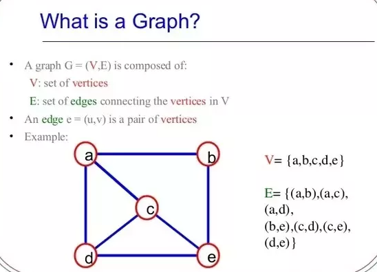

[Graph Data Structure Live URl](https://mujahedyousef.github.io/advanced-js-reading-notes.-/day_25/class_25.html)

## Graph Data Structure

* is a pictorial representation of a set of objects where some pairs of objects are connected by links.
* The interconnected objects are represented by points termed vertices, and the links that connect the vertices are called **edges.**

## important terms

* Vertex − Each node of the graph is represented as a vertex..

* Edge − Edge represents a path between two vertices or a line between two vertices.

* Adjacency − Two node or vertices are adjacent if they are connected to each other through an edge.

* Path − Path represents a sequence of edges between the two vertices.

## Basic Operations

* basic primary operations of a Graph −

1. Add Vertex − Adds a vertex to the graph.

1. Add Edge − Adds an edge between the two vertices of the graph.

1. Display Vertex − Displays a vertex of the graph.

[read more](https://www.tutorialspoint.com/data_structures_algorithms/depth_first_traversal.htm)
