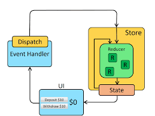

 [Application State with Redux Live Url](https://mujahedyousef.github.io/advanced-js-reading-notes.-/day_26/class_26.html)

## Application State with Redux



* Redux is a predictable state container for JavaScript apps.

* It helps you write applications that behave consistently, run in different environments (client, server, and native), and are easy to test. On top of that, it provides a great developer experience, such as live code editing combined with a time-traveling debugger.

* You can use Redux together with React, or with any other view library. It is tiny (2kB, including dependencies), but has a large ecosystem of addons available.

## Redux Toolkit

 > is our official recommended approach for writing Redux logic. It wraps around the Redux core, and contains packages and functions that we think are essential for building a Redux app. Redux Toolkit builds in our suggested best practices, simplifies most Redux tasks, prevents common mistakes, and makes it easier to write Redux applications.

### Installation

* Redux Toolkit

 ```
 npm install @reduxjs/toolkit
 ```

* Create a React Redux App

```
# Redux + Plain JS template
npx create-react-app my-app --template redux

# Redux + TypeScript template
npx create-react-app my-app --template redux-typescript
```

* Redux Core

```

npm install redux

```

----
[Dan Abramov Redux Tutorials](https://egghead.io/courses/fundamentals-of-redux-course-from-dan-abramov-bd5cc867)
[worlds easiest guide to redux](https://www.freecodecamp.org/news/understanding-redux-the-worlds-easiest-guide-to-beginning-redux-c695f45546f6)

[testing reducers](https://medium.com/@netxm/testing-redux-reducers-with-jest-6653abbfe3e1)

[Redux Docs](https://redux.js.org/)
