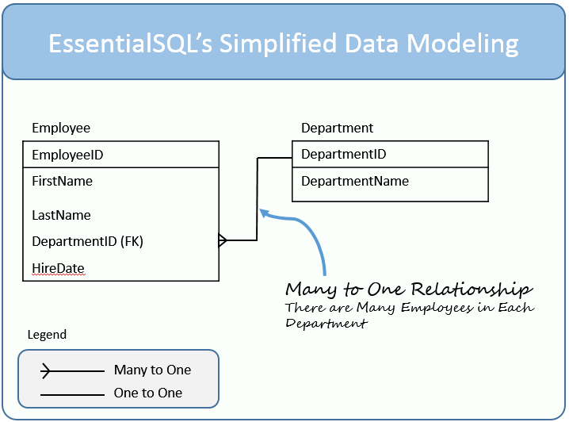

# Class 04

## Subjects

- Nosql vs sql.
- Sql modeling techniques.
- Sequelize api

----

## Review, Research, and Discussion

>- Answer (Q1) => Advantages for TDD:

 1) The software design becomes modular.  
 2) The code is easier to Maintain.
 3) Code refactoring goes more smoothly.
 4) Developers have less debugging to do.

>- Answer (Q2) => Cases i need for  used :
>
 1) beforeEach( ) : Is run before each test in a describe,"executing all time before beginning all try (it)".
 2) afterEach( ) :  is run after each test in a describe, "executing all time after finishing all try (it)".
 3) before( ) : is run once before all the tests in a describe, "executing one time before beginning anything (it)".
 4) after( ) :  is run once after all the tests in a describe,
 "executing one time after finishing all thing (it)"  .

>- Answer (Q3) => Downside of Test Driven Development :
>
1) TDD approach is difficult to learn.
2) TDD slows down the development process.

>- Answer (Q4) => Difference between ES6 Classes and Constructor/Prototype Classes :
[Read more](https://www.toptal.com/javascript/es6-class-chaos-keeps-js-developer-up).
>- Answer (Q5) => Why REST ? :

1) **Representational State Transfer (REST) is an architectural style popular its simplicity and scalability.**
2) REST is Easy to Understand and Implement
3) REST Makes your Application More Scalable.
4) Caching is Easier with REST
5) [To Read more](https://www.freecodecamp.org/news/benefits-of-rest/)

----

## Document the following Vocabulary Terms

|  Term  |   Meaning |
|--- |--- |
| functional programming  |   Is a programming paradigm in which we try to bind everything in pure mathematical functions style. It is a declarative type of programming style. Its main focus is on “what to solve” in contrast to an imperative style where the main focus is “how to solve". [Read more](https://www.geeksforgeeks.org/functional-programming-paradigm/). |
| object-oriented programming (OOP)   | Is a computer programming model that organizes software design around data, or objects, rather than functions and logic. An object can be defined as a data field that has unique attributes and behavior.  [Read more](https://www.techtarget.com/searchapparchitecture/definition/object-oriented-programming-OOP). |
|  class |  Classes are a template for creating objects. They encapsulate data with code to work on that data. Classes in JS are built on prototypes but also have some syntax and semantics that are not shared with ES5 class-like semantics. [Read more](https://developer.mozilla.org/en-US/docs/Web/JavaScript/Reference/Classes). |
| super   | The super keyword is used to access and call functions on an object's parent.  [Read more](https://developer.mozilla.org/en-US/docs/Web/JavaScript/Reference/Operators/super).  |
|  this |  In JavaScript, the this keyword refers to an object.  Which object depends on how this is being invoked (used or called).  [Read more](https://www.w3schools.com/js/js_this.asp). |
|  Test Driven Development (TDD)  | Is software development approach in which test cases are developed to specify and validate what the code will do. [Read more](https://www.guru99.com/test-driven-development.html).   |
|  Jest | Is a JavaScript Testing Framework. [Read more](https://jestjs.io/).   |
|  Continuous Integration (CI)  | is the development practice where developers integrate code into a shared repository frequently. A good CI setup speeds up your workflow. [Read more](https://www.cloudbees.com/blog/7-ways-know-youve-aced-continuous-integration).    |
|  REST (Representational state transfer) | The architectural style for distributed hypermedia systems. [Read more](https://restfulapi.net/).  |
|  Data Model  |Are visual representations of an enterprise's data elements and the connections between them. [Read more](https://www.erwin.com/solutions/data-modeling/data-model.aspx).   |
----

## Different between SQL & NOSQL

|  SQL          | NOSQL  |
|---            |---     |
|Is a standard language for storing, manipulating and retrieving data in databases.         |Databases are purpose-built for specific data models and have flexible schemas for building modern applications.   |
| 1. Databases are primarily called as Relational Databases (RDBMS).                | Are primarily called as non-relational or distributed database.        |
|2. Are table based databases (represent data in form of tables which consists of n number of rows of data).              |Are document-based, key-value pairs, graph databases, or wide-column stores.        |
|3. Have predefined schema.               | Have dynamic schema for unstructured data.       |
|  4.   Are scaled by increasing the horse-power of the hardware. | Are scaled by increasing the databases servers in the pool of resources to reduce the load.  |
|5. Uses SQL ( structured query language ) for defining and manipulating the data.              |  Database, queries are focused on the collection of documents. Sometimes it is also called UnQL (Unstructured Query Language).      |
|6. Examples for her : MySql, Oracle, Sqlite, Postgres and MS-SQL.              | Examples for her: MongoDB, BigTable, Redis, RavenDb, Cassandra, Hbase, Neo4j and CouchDb.       |
| 7. For complex queries.              | Not good fit for complex queries.       |
| 8. Are not the best fit for hierarchical data storage.              |  Are fits better for the hierarchical data storage as it follows the key-value pair way of storing data similar to JSON data(for large data set ).       |
|9.  SQL databases are vertically scalable from during(increasing the CPU, RAM, SSD, etc, on a single server).               |Are horizontally scalable from during(add a few more servers).       |
|10. Are the best fit for heavy-duty transactional type applications.               |   Can use for transactions purposes but is still not comparable.      |
| 11. Properties emphasize ACID properties ( Atomicity, Consistency, Isolation, and Durability).              | Follows the Brewers CAP theorem ( Consistency, Availability, and Partition tolerance ).       |
|12. Types: open-source.               | Classified on the basis of the way of storing data as graph databases, key-value store databases, document store databases, column store database and XML databases. |
----

## SQL modeling techniques

> Create diagrams of the database tables and their and show relationships.

- Why a data model?

1. Helps to visualize the business.
2. A model is a means of communication.
3. Models help elicit and document requirements.
4. Models reduce the cost of change.
5. Model is the essence of DW architecture based on which DW will be implemented.

- Data Modeling – Table Elements.
.

- Data Modeling – Table Relationships.
.

 > all these elementss specific for models.

- Table.

- Field.

- Primary Key.

- Compound Key.

- Foreign Key.

- One to Many Relationship.

- One to One Relationship.

----

## Sequelize API

 > Is a promise-based Node.js ORM tool for Postgres, MySQL, MariaDB, SQLite, Microsoft SQL Server, Amazon Redshift, Snowflake’s Data Cloud, DB2, and IBM i. It features solid transaction support, relations, eager and lazy loading, read replication and more.

- >1) Installing : npm i sequelize.

- >2) Connecting to a database :

- >3) Testing the connection :

- >3) Closing the connection : Call sequelize.close() (which is asynchronous and returns a Promise).
