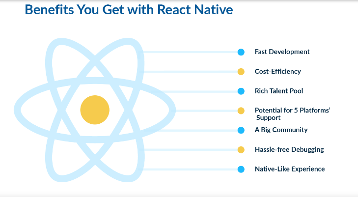

[React Native Live URL](https://mujahedyousef.github.io/advanced-js-reading-notes.-/day_30/class_30.html)

## React Native

* a best-in-class JavaScript library for building user interfaces.
* You can use React Native today in your existing Android and iOS projects or you can create a whole new app from scratch
* React primitives render to native platform UI, meaning your app uses the same native platform APIs other apps do.
* With React Native, one team can maintain two platforms and share a common technology—React.

### Native Development For Everyone

React Native lets you create truly native apps and doesn't compromise your users' experiences. It provides a core set of platform-agnostic native components like

* View,
* Text,
* Image that map directly to the platform’s native UI building blocks.

### Seamless Cross-Platform

React components wrap existing native code and interact with native APIs via React’s declarative UI paradigm and JavaScript. This enables native app development for whole new teams of developers and can let existing native teams work much faster
-----

[expo](https://expo.dev/signup)

[expo snack](https://snack.expo.dev/)

[ejecting](https://docs.expo.dev/expokit/eject/?redirected)
