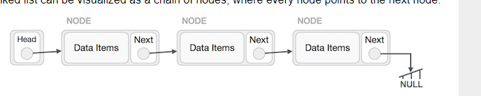

# Linked List

> Linked List is a sequence of links which contains items. Each link contains a connection to another link. Linked list is the second most-used data structure after array. Following are the important terms to understand the concept of Linked List.

* Link − Each link of a linked list can store a data called an element.

* Next − Each link of a linked list contains a link to the next link called Next.

* LinkedList − A Linked List contains the connection link to the first link called First.

## Linked List Representation

> Linked list can be visualized as a chain of nodes, where every node points to the next node.

* Linked List contains a link element called first.

* Each link carries a data field(s) and a link field called next.

* Each link is linked with its next link using its next link.

* Last link carries a link as null to mark the end of the list.

## Types of Linked List

* Simple Linked List − Item navigation is forward only.

* Doubly Linked List − Items can be navigated forward and backward.

* Circular Linked List − Last item contains link of the first element as next and the first element has a link to the last element as previous.

## Basic Operations

>the basic operations supported by a list.

* Insertion − Adds an element at the beginning of the list.

* Deletion − Deletes an element at the beginning of the list.

* Display − Displays the complete list.

* Search − Searches an element using the given key.

* Delete − Deletes an element using the given key.

----
