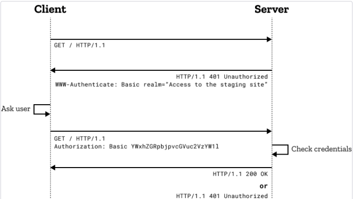

# The conclusion I understood from Read: Class 06 🧐

>##  Displayed The keywords 📋

1) Securing Passwords.
2) Basic Auth.
3) OWASP auth cheatsheet.
4) bcrypt docs.

----

## Securing Passwords

>Passwords are the first line of defense against cyber criminals. It is the most vital secret of every activity we do over the internet and also a final check to get into any of your user account.

### Be stored using a hashing algorithm

* Hashing is the greatest way for protecting passwords and is considered to be pretty safe for ensuring the integrity of data or passwords.

* The benefit of hashing is that if someone steals the database with hashed passwords, they only make off with the hashes and not the actual plaintext passwords.

> PROBLEMS WITH CRYPTOGRAPHIC HASH ALGORITHM.

1. Brute Force attack : Hashes can't be reversed, so instead of reversing the hash of the password, an attacker can simply keep trying different inputs until he does not find the right now that generates the same hash value.

 > Using a modern computer one can crack a 16 Character Strong password in less than an hour, thanks to GPU

2. Hash Collision attack : Hash functions have infinite input length and a predefined output length, so there is inevitably going to be the possibility of two different inputs that produce the same output hash.

> Salting your password may foil dictionary attacks, but an attacker can still use a wordlist to crack the hashes.

* ### BCrypt exactly good for securing your passwords with hashing

* we need algorithms which can make the brute force attacks slower and minimize the impact. Such algorithms are **PBKDF2** and **BCrypt**, both of these algorithms use a technique called **Key Stretching**.

* > **Bcrypt** :=> is an adaptive hash function based on the Blowfish symmetric block cipher cryptographic algorithm and introduces a work factor (also known as security factor), which allows you to determine how expensive the hash function will be.
* How to be effective?

1) work factor value determines how slow the hash function will be.

2) Generate different hash values in different time spans

* This method of hashing passwords is solid enough for most web applications that store users' passwords and other sensitive data.

----

## Basic access authentication

> Is a method for an HTTP user agent (e.g., a web browser) to provide a username and password when making a request.

* The general HTTP authentication framework.

* RFC 7235 defines the HTTP authentication framework, which can be used by a server to challenge a client request, and by a client to provide authentication information.

> The challenge and response flow works like this:

* The server responds to a client with a 401 (Unauthorized) response status and provides information on how to authorize with a WWW-Authenticate response header containing at least one challenge.
* A client that wants to authenticate itself with the server can then do so by including an Authorization request header with the credentials.
* Usually a client will present a password prompt to the user and will then issue the request including the correct Authorization header.

* 

----

## Authentication Cheat Sheet

> **Authentication** is the process of verifying that an individual, entity or website is whom it claims to be.

> **Session Management** is a process by which a server maintains the state of an entity interacting with it.

* Authentication Solution and Sensitive Accounts

1) Do NOT allow login with sensitive accounts (i.e. accounts that can be used internally within the solution such as to a back-end / middle-ware / DB) to any front-end user-interface.

2) Do NOT use the same authentication solution (e.g. IDP / AD) used internally for unsecured access (e.g. public access / DMZ).
[read more](https://cheatsheetseries.owasp.org/cheatsheets/Authentication_Cheat_Sheet.html)

----

## bcrypt docs

> node.bcrypt.js => A library to help you hash passwords.

* node-gyp only works with stable/released versions of node.

 > Dependencies:

1. NodeJS
1. node-gyp

* Install via NPM

> npm install bcrypt

* bcrypt uses whatever Promise implementation is available in global.Promise.

* **To hash a password:**

>(generate a salt and hash on separate function calls)
>
>(auto-gen a salt and hash).

[read more](https://www.npmjs.com/package/bcrypt)
